# Wizard Framework

<div align="center">

**A Framework for Designing LLM Experiences**

[](https://www.npmjs.com/package/@swizzy_ai/kit)
[](https://opensource.org/licenses/MIT)

[Install](#installation) • [Documentation](https://docs.wizard.dev) • [Examples](#examples)

</div>

---

## Why Wizard Exists

### The Current State is Broken

Today's LLM orchestration assumes the **LLM itself is the agent** - an intelligent entity you hand tools to and hope it figures things out. This paradigm works brilliantly in controlled environments (see: Claude Code's success), but fails catastrophically when:

- The environment isn't perfectly curated
- Mistakes or hallucinations have real costs
- Context limits constrain what the model can see
- Each turn summons a "new spirit" with no memory of the last

The mental model is fundamentally flawed.

### What Wizard Believes

**Real agency and intelligence are emergent products of process and design.**

Wizard inverts the paradigm: the **developer is the orchestrator**, the **LLM is the user**. You design the experience - what information to present, what to collect, what happens next. The LLM focuses on what it does best: generating the most plausible text for each scenario.

This is agentic Lego bricks, not autonomous agents.

---

## Installation

```bash
npm install @swizzy_ai/kit
```

```javascript
const { Wizard, Models } = require('@swizzy_ai/kit');

const wizard = new Wizard({ id: 'my-workflow' });
```

---

## The Framework

### Steps: The Core Building Block

A **Step** is where you define:
1. What to ask the LLM
2. What piece of context/state to update
3. What step to execute next

Every step has five components:

---

### 1. Step Variants (The Type)

Choose the right step type for your task:

#### Normal Step (Structured Data)
Provides an instruction + schema. The LLM generates a structured object matching that schema.

```javascript
wizard.addStep({
  id: 'extract_entities',
  instruction: 'Extract entities from: {{text}}',
  schema: z.object({
    people: z.array(z.string()),
    organizations: z.array(z.string())
  }),
  model: Models.SWIZZY_DEFAULT,
  update: (result, context, actions) => {
    // result is guaranteed to match schema
    actions.updateContext({ entities: result });
    return actions.next();
  }
});
```

#### Text Step (Simple Text)
Collects a single text response. No schema needed.

```javascript
wizard.addTextStep({
  id: 'summarize',
  instruction: 'Summarize: {{document}}',
  model: Models.SWIZZY_DEFAULT,
  update: (text, context, actions) => {
    actions.updateContext({ summary: text });
    return actions.next();
  }
});
```

#### Compute Step (Non-LLM Logic)
For calculations, API calls, validation - anything that doesn't need an LLM.

```javascript
wizard.addComputeStep({
  id: 'validate',
  update: (result, context, actions) => {
    if (context.entities.people.length === 0) {
      return actions.retry(); // No entities found
    }
    return actions.next();
  }
});
```

---

### 2. Context Function (What the LLM Sees)

The `contextFunction` lets you control exactly what information the LLM receives. It transforms the full context into a focused view.

```javascript
wizard.setContext({
  documents: [
    { title: 'Q1 Report', pages: 45, data: [...] },
    { title: 'Q2 Report', pages: 52, data: [...] }
  ]
});

wizard.addTextStep({
  id: 'analyze',
  instruction: 'Analyze these documents:\n{{formattedDocs}}',
  contextFunction: (context) => ({
    // Transform complex data into LLM-friendly format
    formattedDocs: context.documents
      .map((doc, i) => `${i + 1}. ${doc.title} (${doc.pages} pages)`)
      .join('\n')
  }),
  schema: z.object({
    insights: z.array(z.string())
  }),
  model: Models.SWIZZY_DEFAULT,
  update: (result, context, actions) => {
    actions.updateContext({ insights: result.insights });
    return actions.next();
  }
});
```

**Why This Matters**: You design the information architecture. The LLM never sees irrelevant data.

---

### 3. Instruction (The Prompt Template)

The instruction is the text shown to the LLM. It's a template engine that processes the context function at runtime, replacing `{{variables}}` with real data.

```javascript
wizard.addTextStep({
  id: 'greet_user',
  instruction: 'Greet {{userName}} who has {{documentCount}} documents',
  // At runtime becomes: "Greet Alice who has 5 documents"
  contextFunction: (context) => ({
    userName: context.user.name,
    documentCount: context.user.documents.length
  }),
  model: Models.SWIZZY_DEFAULT,
  update: (text, context, actions) => {
    console.log(text);
    return actions.next();
  }
});
```

---

### 4. Update Function (State Mutation)

After a step runs, the `update` function:
- Updates context/state with new information
- Executes control actions (next step, retry, etc.)

```javascript
wizard.addTextStep({
  id: 'analyze_sentiment',
  instruction: 'Analyze sentiment: {{text}}',
  schema: z.object({
    sentiment: z.enum(['positive', 'negative', 'neutral']),
    confidence: z.number()
  }),
  model: Models.SWIZZY_DEFAULT,
  update: (result, context, actions) => {
    // Update state
    actions.updateContext({
      sentiment: result.sentiment,
      confidence: result.confidence
    });

    // Control flow
    if (result.confidence < 0.7) {
      return actions.retry(); // Low confidence, try again
    }
    return actions.next(); // Continue
  }
});
```

---

### 5. Control Actions (Flow Signals)

Actions control which step runs next. This is how you design the agentic experience.

```javascript
wizard.addComputeStep({
  id: 'router',
  update: (result, context, actions) => {
    // Sequential flow
    if (context.simple) {
      return actions.next();
    }

    // Jump to specific step
    if (context.needsValidation) {
      return actions.goto('validate_data');
    }

    // Retry current step
    if (context.error) {
      return actions.retry();
    }

    // Stop workflow
    if (context.complete) {
      return actions.stop();
    }

    // Wait 10 seconds
    return actions.wait();
  }
});
```

**Available Actions:**

| Action | Purpose |
|--------|---------|
| `actions.next()` | Go to next sequential step |
| `actions.goto('stepId')` | Jump to specific step |
| `actions.retry()` | Retry current step |
| `actions.stop()` | End workflow |
| `actions.wait()` | Pause for 10 seconds |

---

## Advanced Patterns

### The Bungee Action (Parallelism)

The **Bungee Action** is Wizard's most powerful pattern. It implements fan-out/fan-in: run a step multiple times in parallel, then return to the anchor.

**Anatomy:**
- **Anchor Step**: Where the bungee launches from
- **Destination Step**: The step that runs in parallel
- **Batch**: Each parallel run sees unique information
- **Return**: All parallel runs complete, anchor continues

```mermaid
graph TD
    A[Anchor Step] --> B[🪂 Bungee Jump]
    B --> C[Worker 1: Item A]
    B --> D[Worker 2: Item B]
    B --> E[Worker N: Item Z]
    C --> F[Collect Results]
    D --> F
    E --> F
    F --> G[Return to Anchor]
    G --> H[Continue Flow]
```



#### Real Example: Parallel Document Search

```javascript
wizard.setContext({
  userQuestion: 'What are the key findings?',
  totalPages: 100
});

// Anchor step
wizard.addComputeStep({
  id: 'parallel_search',
  update: (result, context, actions) => {
    return actions.bungee.init()
      .batch(
        'search_page',              // Destination step
        context.totalPages,         // Run 100 times
        (pageIndex) => ({           // Each run gets unique context
          pageNumber: pageIndex + 1,
          query: context.userQuestion
        })
      )
      .config({ 
        concurrency: 10,  // 10 parallel workers
        timeout: 30000    // 30s timeout per worker
      })
      .jump(); // Launch!
  }
});

// Destination step (runs 100 times in parallel)
wizard.addTextStep({
  id: 'search_page',
  instruction: 'Search page {{pageNumber}} for: {{query}}',
  schema: z.object({
    hasRelevantInfo: z.boolean(),
    excerpt: z.string().optional()
  }),
  model: Models.SWIZZY_DEFAULT,
  update: (result, context, actions) => {
    if (result.hasRelevantInfo) {
      // Store result with unique key
      actions.updateContext({
        [`page_${context.pageNumber}_result`]: result.excerpt
      });
    }
    return actions.next(); // Return to anchor
  }
});

// Back at anchor - collect results
wizard.addComputeStep({
  id: 'collect_results',
  update: (result, context, actions) => {
    const allResults = Object.keys(context)
      .filter(key => key.startsWith('page_'))
      .map(key => context[key]);
    
    actions.updateContext({ searchResults: allResults });
    return actions.next();
  }
});
```

**Power Move**: Process 100 pages in 30 seconds instead of 5 minutes.

**When to Use Bungee:**
- Batch processing (documents, images, data)
- Parallel API calls
- Multi-source information gathering
- Any workflow bottleneck that can be parallelized

---

## Comparison with Alternatives

| Feature | Wizard | LangChain | Vercel AI SDK | Raw LLM APIs |
|---------|---------|-----------|---------------|--------------|
| **Mental Model** | Developer orchestrates, LLM executes | LLM is the agent | Linear chat flows | Full manual control |
| **Context Control** | ✅ Context functions + templates | ⚠️ Chain-based passing | ❌ Manual | ❌ Manual |
| **State Machine** | ✅ Explicit action signals | ❌ Sequential chains | ❌ Linear only | ❌ Build yourself |
| **Type Safety** | ✅ Zod validation on outputs | ⚠️ Optional | ⚠️ TypeScript only | ❌ None |
| **Parallelism** | ✅ Bungee actions | ❌ Manual orchestration | ❌ Manual | ❌ Manual |
| **Flow Control** | ✅ next/goto/retry/stop/wait | ⚠️ Limited | ⚠️ Limited | ❌ Manual |
| **Learning Curve** | Medium | Steep | Low | High |
| **Best For** | Complex multi-step workflows | General orchestration | Simple chat | Full control |

---

## Complete Example

```javascript
const { Wizard, Models } = require('@swizzy_ai/kit');
const { z } = require('zod');

const wizard = new Wizard({
  id: 'document-analyzer',
  onUsage: (usage, provider) => {
    console.log(`📊 Used ${usage.totalTokens} tokens`);
  }
});

// Initialize context
wizard.setContext({
  documentText: 'Your document content here...',
  userQuery: 'Extract key insights'
});

// Step 1: Extract entities
wizard.addTextStep({
  id: 'extract_entities',
  instruction: 'Extract named entities from: {{documentText}}',
  schema: z.object({
    people: z.array(z.string()),
    organizations: z.array(z.string()),
    confidence: z.number()
  }),
  model: Models.SWIZZY_DEFAULT,
  update: (result, context, actions) => {
    if (result.confidence < 0.8) {
      return actions.retry(); // Low confidence, retry
    }
    actions.updateContext({ entities: result });
    return actions.next();
  }
});

// Step 2: Validate entities
wizard.addComputeStep({
  id: 'validate_entities',
  update: (result, context, actions) => {
    const hasEntities = context.entities.people.length > 0 ||
                       context.entities.organizations.length > 0;
    
    if (!hasEntities) {
      return actions.goto('extract_entities'); // Retry extraction
    }
    return actions.next();
  }
});

// Step 3: Generate summary
wizard.addTextStep({
  id: 'generate_summary',
  instruction: 'Summarize key insights about: {{entityList}}',
  contextFunction: (context) => ({
    entityList: [
      ...context.entities.people.map(p => `Person: ${p}`),
      ...context.entities.organizations.map(o => `Org: ${o}`)
    ].join('\n')
  }),
  schema: z.object({
    summary: z.string(),
    keyInsights: z.array(z.string())
  }),
  model: Models.SWIZZY_DEFAULT,
  update: (result, context, actions) => {
    console.log('Summary:', result.summary);
    console.log('Insights:', result.keyInsights);
    return actions.stop(); // Done!
  }
});

// Run the workflow
wizard.run();
```

---

## API Reference

### Wizard Constructor

```typescript
new Wizard(config: {
  id: string;
  systemPrompt?: string;
  onUsage?: (usage: TokenUsage, provider: string) => void;
})
```

### Core Methods

| Method | Description |
|--------|-------------|
| `setContext(data)` | Initialize workflow context |
| `getContext()` | Retrieve current context |
| `updateContext(data)` | Update context (fluent API) |
| `addTextStep(config)` | Add LLM-powered step |
| `addComputeStep(config)` | Add logic-only step |
| `addStep(config)` | Add custom step |
| `run()` | Execute the workflow |

### Actions Interface

Available in every `update` function:

```typescript
{
  updateContext: (updates: object) => void;
  next: () => FlowControlSignal;
  goto: (stepId: string) => FlowControlSignal;
  retry: () => FlowControlSignal;
  stop: () => FlowControlSignal;
  wait: () => FlowControlSignal;
  bungee: {
    init: () => BungeeBuilder;
  }
}
```

---

## Examples

Check the `/examples` directory for complete workflows:

- **Document Analyzer**: Extract entities and generate insights
- **Parallel Search**: Search 100+ pages using Bungee actions
- **Multi-Step Validation**: Complex validation with retry logic
- **Data Pipeline**: Transform and validate data across steps

---

## Contributing

We welcome contributions! Please see [CONTRIBUTING.md](./CONTRIBUTING.md) for guidelines.

```bash
# Setup
git clone https://github.com/swizzy-ai/wizard-framework.git
npm install

# Development
npm test        # Run tests
npm run build   # Build TypeScript
```

---

## License

MIT License - see [LICENSE](./LICENSE) for details.

---

<div align="center">

**Invert the paradigm. Design the experience.**

[GitHub](https://github.com/swizzy-ai/wizard-framework) • [Documentation](https://docs.wizard.dev) • [Discord](https://discord.gg/wizard)

⭐ Star us on GitHub if Wizard changes how you build with LLMs

</div>