# Wizard Framework

<div align="center">

**A Framework for Designing LLM Experiences**

[](https://www.npmjs.com/package/@swizzy_ai/kit)
[](https://opensource.org/licenses/MIT)

[Install](#installation) • [Documentation](https://docs.wizard.dev) • [Examples](#examples)

</div>

---

## Why Wizard Exists

### The Current State is Broken

Today's LLM orchestration assumes the **LLM itself is the agent** - an intelligent entity you hand tools to and hope it figures things out. This paradigm works brilliantly in controlled environments (see: Claude Code's success), but fails catastrophically when:

- The environment isn't perfectly curated
- Mistakes or hallucinations have real costs
- Context limits constrain what the model can see
- Each turn summons a "new spirit" with no memory of the last

The mental model is fundamentally flawed.

### What Wizard Believes

**Real agency and intelligence are emergent products of process and design.**

Wizard inverts the paradigm: the **developer is the orchestrator**, the **LLM is the user**. You design the experience - what information to present, what to collect, what happens next. The LLM focuses on what it does best: generating the most plausible text for each scenario.

This is agentic Lego bricks, not autonomous agents.

---

## Installation

```bash
npm install @swizzy_ai/kit
```

### API Key Configuration

For multimodal functions and different LLM providers, set all your API keys as environment variables:

```bash
# Include multiple API keys
OPENAI_API_KEY="your-openai-key"
ANTHROPIC_API_KEY="your-anthropic-key"
GEMINI_API_KEY="your-gemini-key"
```

Or configure them programmatically:

```javascript
const { Wizard, Models } = require('@swizzy_ai/kit');

const wizard = new Wizard({
  id: 'my-workflow',
});
```

---

## Core Concepts

### Understanding Wizard's Architecture

Wizard workflows operate on a simple execution loop:

```
Step → LLM Generation → Update Function → Signal → Next Step
```

You, the developer, design each step in this loop:
- **What the LLM sees** (via context functions)
- **What the LLM generates** (via instructions and schemas)
- **What happens next** (via signals)

The LLM never decides where to go or what to do - it only generates text based on what you show it and where to tell it. You orchestrate the intelligence.

---

### Context and State Management

**Context** is the shared state that flows through your entire workflow. Every step can read from it and write to it.

#### Setting Initial Context

```javascript
wizard.setContext({
  userQuestion: 'What are the key findings?',
  documents: [
    { title: 'Q1 Report', pages: 45, data: [...] },
    { title: 'Q2 Report', pages: 52, data: [...] }
  ],
  processedCount: 0
});
```

#### Reading Context

Context is available in every `update` function and `context`:

```javascript
wizard.addComputeStep({
  id: 'check_status',
  update: (result, context, actions) => {
    // Access any context property
    console.log(`Processed ${context.processedCount} documents`);
    return actions.next();
  }
});
```

#### Updating Context

```javascript
wizard.addComputeStep({
  id: 'increment_counter',
  update: (result, context, actions) => {
    actions.updateContext({
      processedCount: context.processedCount + 1
    });
    return actions.next();
  }
});
```

#### Context Functions: Controlling What the LLM Sees

The `context` transforms your full context into a focused view for the LLM. This is where you design the information architecture.

```javascript
wizard.addTextStep({
  id: 'analyze',
  instruction: 'Analyze these documents:\n{{formattedDocs}}',
  context: (context) => ({
    // Transform complex data into LLM-friendly format
    formattedDocs: context.documents
      .map((doc, i) => `${i + 1}. ${doc.title} (${doc.pages} pages)`)
      .join('\n'),
    // Only expose what's needed
    totalDocs: context.documents.length
  }),
  schema: z.object({
    insights: z.array(z.string())
  }),
  model: Models.SWIZZY_DEFAULT,
  update: (result, context, actions) => {
    actions.updateContext({ insights: result.insights });
    return actions.next();
  }
});
```

**Why This Matters**: 
- Keep token usage low by showing only relevant data
- Present information in the optimal format
- Prevent the LLM from seeing sensitive or confusing data
- Design the exact "user interface" the LLM experiences

---

### Steps: The Building Blocks

A **Step** is the fundamental unit of a Wizard workflow. Each step defines a single action in your process.

#### Step Anatomy

Every step has five components:

1. **ID**: Unique identifier for the step
2. **Type**: What kind of step (text, structured, or compute)
3. **Instruction**: What to ask the LLM (for LLM steps)
4. **Context Function**: What information to expose (optional)
5. **Update Function**: How to handle the result and what to do next

#### Step Variants

Choose the right step type for your task:

**Normal Step (Structured Data)**

Use when you need the LLM to generate data matching a specific schema:

```javascript
wizard.addStep({
  id: 'extract_entities',
  instruction: 'Extract entities from: {{text}}',
  schema: z.object({
    people: z.array(z.string()),
    organizations: z.array(z.string()),
    locations: z.array(z.string())
  }),
  model: Models.SWIZZY_DEFAULT,
  update: (result, context, actions) => {
    // result is guaranteed to match schema
    actions.updateContext({ entities: result });
    return actions.next();
  }
});
```

**Text Step (Simple Text)**

Use when you just need a text response without structured data:

```javascript
wizard.addTextStep({
  id: 'summarize',
  instruction: 'Summarize: {{document}}',
  model: Models.SWIZZY_DEFAULT,
  update: (text, context, actions) => {
    actions.updateContext({ summary: text });
    return actions.next();
  }
});
```

**Compute Step (Non-LLM Logic)**

Use for calculations, API calls, validation, or any logic that doesn't need an LLM:

```javascript
wizard.addComputeStep({
  id: 'validate',
  update: (result, context, actions) => {
    if (context.entities.people.length === 0) {
      return actions.retry(); // No entities found, retry
    }
    
    // Call external API
    const enrichedData = await fetch(`/api/enrich`, {
      method: 'POST',
      body: JSON.stringify(context.entities)
    });
    
    actions.updateContext({ enrichedData });
    return actions.next();
  }
});
```

---

### Instructions: Prompt Templates

The **instruction** is the prompt shown to the LLM. It uses a template engine that replaces `{{variables}}` with data from your context function.

#### Basic Template Syntax

```javascript
wizard.addTextStep({
  id: 'greet_user',
  instruction: 'Greet {{userName}} who has {{documentCount}} documents',
  context: (context) => ({
    userName: context.user.name,
    documentCount: context.user.documents.length
  }),
  model: Models.SWIZZY_DEFAULT,
  update: (text, context, actions) => {
    console.log(text); // "Hello Alice! I see you have 5 documents."
    return actions.next();
  }
});
```

At runtime, the instruction becomes:
```
"Greet Alice who has 5 documents"
```

#### Multi-line Instructions

```javascript
wizard.addStep({
  id: 'analyze_sentiment',
  instruction: `
You are analyzing customer feedback.

Customer Review:
{{review}}

Previous Sentiment: {{previousSentiment}}

Analyze the sentiment and confidence level.
  `.trim(),
  context: (context) => ({
    review: context.currentReview.text,
    previousSentiment: context.lastSentiment || 'unknown'
  }),
  schema: z.object({
    sentiment: z.enum(['positive', 'negative', 'neutral']),
    confidence: z.number().min(0).max(1)
  }),
  model: Models.SWIZZY_DEFAULT,
  update: (result, context, actions) => {
    actions.updateContext({ 
      lastSentiment: result.sentiment,
      sentimentConfidence: result.confidence
    });
    return actions.next();
  }
});
```

---

### Update Functions: State Mutation and Control

The **update function** runs after a step completes. It's where you:
1. Process the LLM's output
2. Update context/state
3. Decide what happens next (via signals)

#### Function Signature

```javascript
update: (result, context, actions) => {
  // result: The output from this step
  // context: Current workflow state (read-only)
  // actions: Methods to update state and control flow
  
  return actions.next(); // Must return a signal
}
```

#### Processing Results

```javascript
wizard.addStep({
  id: 'extract_data',
  instruction: 'Extract key data from {{document}}',
  schema: z.object({
    title: z.string(),
    date: z.string(),
    amount: z.number()
  }),
  model: Models.SWIZZY_DEFAULT,
  update: (result, context, actions) => {
    // Validate the result
    if (result.amount < 0) {
      console.error('Invalid amount detected');
      return actions.retry();
    }
    
    // Transform the result
    const enrichedData = {
      ...result,
      parsedDate: new Date(result.date),
      formattedAmount: `$${result.amount.toFixed(2)}`
    };
    
    // Update context
    actions.updateContext({ extractedData: enrichedData });
    
    // Continue
    return actions.next();
  }
});
```

---

## Workflow Control: Signals

### What Are Signals?

**Signals** are how steps communicate "what happens next" in your workflow. Every `update` function must return a signal.

Think of signals as the control flow language of Wizard - they let you build complex branching logic, retry mechanisms, and dynamic routing.

---

### Available Signals

#### `actions.next()`

Move to the next sequential step in your workflow.

```javascript
wizard.addComputeStep({
  id: 'step_1',
  update: (result, context, actions) => {
    return actions.next(); // Goes to step_2
  }
});

wizard.addComputeStep({
  id: 'step_2',
  update: (result, context, actions) => {
    return actions.next(); // Goes to step_3
  }
});
```

**Use when**: Following a linear, predictable flow.

---

#### `actions.goto(stepId)`

Jump to a specific step by its ID.

```javascript
wizard.addComputeStep({
  id: 'router',
  update: (result, context, actions) => {
    if (context.needsValidation) {
      return actions.goto('validate_step');
    }
    
    if (context.needsEnrichment) {
      return actions.goto('enrich_step');
    }
    
    return actions.goto('finalize_step');
  }
});

wizard.addComputeStep({
  id: 'validate_step',
  update: (result, context, actions) => {
    // Validation logic
    return actions.next();
  }
});

wizard.addComputeStep({
  id: 'enrich_step',
  update: (result, context, actions) => {
    // Enrichment logic
    return actions.next();
  }
});
```

**Use when**: Implementing conditional branching or complex routing logic.

---

#### `actions.retry()`

Re-run the current step.

```javascript
wizard.addStep({
  id: 'extract_with_retry',
  instruction: 'Extract entities from: {{text}}',
  schema: z.object({
    entities: z.array(z.string()),
    confidence: z.number()
  }),
  model: Models.SWIZZY_DEFAULT,
  update: (result, context, actions) => {
    // Retry if confidence is too low
    if (result.confidence < 0.8) {
      const retryCount = context.retryCount || 0;
      
      if (retryCount < 3) {
        actions.updateContext({ retryCount: retryCount + 1 });
        return actions.retry();
      }
    }
    
    // Success or max retries reached
    actions.updateContext({ finalEntities: result.entities });
    return actions.next();
  }
});
```

**Use when**: The LLM output needs improvement or validation failed.

**Pro tip**: Track retry counts to avoid infinite loops.

---

#### `actions.stop()`

End the workflow immediately.

```javascript
wizard.addComputeStep({
  id: 'check_completion',
  update: (result, context, actions) => {
    if (context.allDocumentsProcessed) {
      console.log('Workflow complete!');
      return actions.stop(); // End here
    }
    
    return actions.next(); // Continue processing
  }
});
```

**Use when**: Early termination, error conditions, or goal achievement.

---

#### `actions.wait()`

Pause for 10 seconds before continuing to the next step.

```javascript
wizard.addComputeStep({
  id: 'rate_limit_handler',
  update: (result, context, actions) => {
    if (context.apiCallsThisMinute >= 60) {
      console.log('Rate limit reached, waiting...');
      actions.updateContext({ apiCallsThisMinute: 0 });
      return actions.wait(); // Pause 10 seconds
    }
    
    return actions.next();
  }
});
```

**Use when**: Rate limiting, waiting for external systems, or pacing execution.

---

### Signal Patterns

#### Sequential Execution

```javascript
wizard.addTextStep({
  id: 'step_1',
  instruction: 'Do task 1',
  model: Models.SWIZZY_DEFAULT,
  update: (text, context, actions) => {
    actions.updateContext({ task1Result: text });
    return actions.next();
  }
});

wizard.addTextStep({
  id: 'step_2',
  instruction: 'Do task 2 using {{task1Result}}',
  model: Models.SWIZZY_DEFAULT,
  update: (text, context, actions) => {
    return actions.next();
  }
});
```

#### Conditional Routing

```javascript
wizard.addComputeStep({
  id: 'router',
  update: (result, context, actions) => {
    if (context.complexity === 'simple') {
      return actions.goto('simple_path');
    } else if (context.complexity === 'medium') {
      return actions.goto('medium_path');
    } else {
      return actions.goto('complex_path');
    }
  }
});
```

#### Retry with Backoff

```javascript
wizard.addStep({
  id: 'api_call_with_retry',
  instruction: 'Process: {{data}}',
  schema: z.object({ success: z.boolean() }),
  model: Models.SWIZZY_DEFAULT,
  update: (result, context, actions) => {
    if (!result.success) {
      const retries = context.retries || 0;
      
      if (retries < 3) {
        actions.updateContext({ retries: retries + 1 });
        return actions.wait(); // Wait before retry
      }
      
      return actions.goto('error_handler');
    }
    
    return actions.next();
  }
});
```

#### Loop Pattern

```javascript
wizard.addComputeStep({
  id: 'process_items',
  update: (result, context, actions) => {
    const currentIndex = context.currentIndex || 0;
    
    if (currentIndex < context.items.length) {
      actions.updateContext({ 
        currentItem: context.items[currentIndex],
        currentIndex: currentIndex + 1
      });
      return actions.goto('process_single_item');
    }
    
    // All items processed
    return actions.next();
  }
});

wizard.addTextStep({
  id: 'process_single_item',
  instruction: 'Process: {{currentItem}}',
  model: Models.SWIZZY_DEFAULT,
  update: (text, context, actions) => {
    // Store result
    actions.updateContext({
      [`result_${context.currentIndex}`]: text
    });
    // Loop back
    return actions.goto('process_items');
  }
});
```

---

## Advanced Patterns

### The Bungee Action: Parallelism

The **Bungee Action** is Wizard's most powerful pattern. It implements fan-out/fan-in: launch a step multiple times in parallel, then automatically return to the anchor point.

#### Anatomy of a Bungee

- **Anchor Step**: Where the bungee launches from (typically a compute step)
- **Destination Step**: The step that runs in parallel for each item
- **Batch**: Each parallel run receives unique context
- **Fan-in**: All parallel runs complete, execution returns to the anchor
- **Continuation**: The anchor's next signal determines where to go

```mermaid
graph TD
    A[Anchor Step] --> B[🪂 Bungee Launch]
    B --> C[Worker 1: Item A]
    B --> D[Worker 2: Item B]
    B --> E[Worker N: Item Z]
    C --> F[All Complete]
    D --> F
    E --> F
    F --> G[Return to Anchor]
    G --> H[Continue Flow]
```



---

#### Basic Bungee Example

```javascript
wizard.setContext({
  documents: ['doc1.txt', 'doc2.txt', 'doc3.txt']
});

// Anchor step
wizard.addComputeStep({
  id: 'parallel_processor',
  update: (result, context, actions) => {
    return actions.bungee.init()
      .batch(
        'process_document',           // Destination step
        context.documents.length,     // Run 3 times
        (index) => ({                 // Each run gets unique context
          documentName: context.documents[index],
          documentIndex: index
        })
      )
      .config({ 
        concurrency: 2,  // Process 2 at a time
        timeout: 30000   // 30 second timeout per worker
      })
      .jump(); // Launch!
  }
});

// Destination step (runs 3 times in parallel)
wizard.addTextStep({
  id: 'process_document',
  instruction: 'Summarize document: {{documentName}}',
  schema: z.object({
    summary: z.string(),
    wordCount: z.number()
  }),
  model: Models.SWIZZY_DEFAULT,
  update: (result, context, actions) => {
    // Store result with unique key
    actions.updateContext({
      [`summary_${context.documentIndex}`]: result.summary,
      [`wordCount_${context.documentIndex}`]: result.wordCount
    });
    return actions.next(); // Return to anchor
  }
});

// Back at anchor - collect results
wizard.addComputeStep({
  id: 'collect_results',
  update: (result, context, actions) => {
    const allSummaries = context.documents.map((_, i) => 
      context[`summary_${i}`]
    );
    
    actions.updateContext({ allSummaries });
    return actions.next();
  }
});
```

---

#### Real-World Example: Parallel Document Search

Search 100 pages simultaneously instead of sequentially:

```javascript
wizard.setContext({
  userQuestion: 'What are the key findings about climate change?',
  totalPages: 100
});

// Anchor: Launch parallel search
wizard.addComputeStep({
  id: 'parallel_search',
  update: (result, context, actions) => {
    return actions.bungee.init()
      .batch(
        'search_page',
        context.totalPages,         // 100 parallel searches
        (pageIndex) => ({
          pageNumber: pageIndex + 1,
          query: context.userQuestion
        })
      )
      .config({ 
        concurrency: 10,  // 10 workers at a time
        timeout: 30000
      })
      .jump();
  }
});

// Worker: Search a single page
wizard.addTextStep({
  id: 'search_page',
  instruction: 'Search page {{pageNumber}} for information about: {{query}}',
  schema: z.object({
    hasRelevantInfo: z.boolean(),
    excerpt: z.string().optional(),
    relevanceScore: z.number().min(0).max(10).optional()
  }),
  model: Models.SWIZZY_DEFAULT,
  update: (result, context, actions) => {
    if (result.hasRelevantInfo && result.relevanceScore >= 7) {
      actions.updateContext({
        [`page_${context.pageNumber}_excerpt`]: result.excerpt,
        [`page_${context.pageNumber}_score`]: result.relevanceScore
      });
    }
    return actions.next(); // Return to anchor
  }
});

// Collect and rank results
wizard.addComputeStep({
  id: 'collect_and_rank',
  update: (result, context, actions) => {
    const results = [];
    
    for (let i = 1; i <= context.totalPages; i++) {
      const excerpt = context[`page_${i}_excerpt`];
      const score = context[`page_${i}_score`];
      
      if (excerpt) {
        results.push({ page: i, excerpt, score });
      }
    }
    
    // Sort by relevance
    results.sort((a, b) => b.score - a.score);
    
    actions.updateContext({ 
      searchResults: results.slice(0, 10) // Top 10
    });
    
    return actions.next();
  }
});
```

**Performance**: Process 100 pages in ~30 seconds (with concurrency: 10) instead of 5+ minutes sequentially.

---

#### When to Use Bungee

**Perfect for:**
- Batch processing (documents, images, data records)
- Parallel API calls or searches
- Multi-source information gathering
- Any workflow bottleneck that can be parallelized

**Not ideal for:**
- Tasks that must run sequentially
- When order matters
- Shared state that can't be partitioned

---

#### Bungee Configuration Options

```javascript
actions.bungee.init()
  .batch('destination_step', count, contextFn)
  .config({
    concurrency: 10,    // Max parallel workers (default: 5)
    timeout: 30000,     // Timeout per worker in ms (default: 60000)
    retryOnError: true  // Retry failed workers (default: false)
  })
  .jump();
```

---

### Multi-API Configuration

Wizard supports multiple LLM providers. Configure API keys for different models:

```javascript
const wizard = new Wizard({
  id: 'multi-provider-workflow',
  apiKeys: {
    openai: process.env.OPENAI_API_KEY,
    anthropic: process.env.ANTHROPIC_API_KEY,
    gemini: process.env.GEMINI_API_KEY
  }
});

// Use different models for different tasks
wizard.addTextStep({
  id: 'fast_extraction',
  instruction: 'Quick extract: {{data}}',
  model: Models.GPT_4O_MINI,  // Fast, cheap
  update: (text, context, actions) => {
    actions.updateContext({ extracted: text });
    return actions.next();
  }
});

wizard.addTextStep({
  id: 'deep_analysis',
  instruction: 'Deeply analyze: {{extracted}}',
  model: Models.CLAUDE_SONNET,  // Powerful reasoning
  update: (text, context, actions) => {
    actions.updateContext({ analysis: text });
    return actions.next();
  }
});
```

---

## Complete Example

Here's a full workflow that demonstrates all concepts:

```javascript
const { Wizard, Models } = require('@swizzy_ai/kit');
const { z } = require('zod');

const wizard = new Wizard({
  id: 'document-analyzer',
  onUsage: (usage, provider) => {
    console.log(`📊 ${provider}: ${usage.totalTokens} tokens`);
  }
});

// Initialize context
wizard.setContext({
  documentText: 'Your document content here...',
  userQuery: 'Extract key insights',
  maxRetries: 3
});

// Step 1: Extract entities with retry logic
wizard.addStep({
  id: 'extract_entities',
  instruction: 'Extract named entities from: {{documentText}}',
  schema: z.object({
    people: z.array(z.string()),
    organizations: z.array(z.string()),
    confidence: z.number().min(0).max(1)
  }),
  model: Models.SWIZZY_DEFAULT,
  update: (result, context, actions) => {
    const retries = context.extractRetries || 0;
    
    // Low confidence? Retry
    if (result.confidence < 0.8 && retries < context.maxRetries) {
      actions.updateContext({ extractRetries: retries + 1 });
      return actions.retry();
    }
    
    // Store entities
    actions.updateContext({ 
      entities: result,
      extractRetries: 0
    });
    return actions.next();
  }
});

// Step 2: Validate entities
wizard.addComputeStep({
  id: 'validate_entities',
  update: (result, context, actions) => {
    const hasEntities = 
      context.entities.people.length > 0 ||
      context.entities.organizations.length > 0;
    
    if (!hasEntities) {
      console.log('No entities found, retrying extraction');
      return actions.goto('extract_entities');
    }
    
    console.log(`Found ${context.entities.people.length} people, ${context.entities.organizations.length} orgs`);
    return actions.next();
  }
});

// Step 3: Generate summary
wizard.addTextStep({
  id: 'generate_summary',
  instruction: `
Summarize key insights about these entities:

{{entityList}}

Focus on their relationships and significance.
  `.trim(),
  context: (context) => ({
    entityList: [
      ...context.entities.people.map(p => `Person: ${p}`),
      ...context.entities.organizations.map(o => `Organization: ${o}`)
    ].join('\n')
  }),
  schema: z.object({
    summary: z.string(),
    keyInsights: z.array(z.string()),
    confidence: z.number()
  }),
  model: Models.SWIZZY_DEFAULT,
  update: (result, context, actions) => {
    console.log('Summary:', result.summary);
    console.log('Key Insights:');
    result.keyInsights.forEach((insight, i) => {
      console.log(`  ${i + 1}. ${insight}`);
    });
    
    return actions.stop(); // Workflow complete!
  }
});

// Run the workflow
wizard.run();
```

---

## API Reference

### Wizard Constructor

```typescript
new Wizard(config: {
  id: string;
  systemPrompt?: string;
  onUsage?: (usage: TokenUsage, provider: string) => void;
  apiKeys?: {
    openai?: string;
    anthropic?: string;
    gemini?: string;
  }
})
```

### Context Methods

| Method | Description |
|--------|-------------|
| `setContext(data)` | Initialize workflow context |
| `getContext()` | Retrieve current context |
| `updateContext(data)` | Update context (returns Wizard instance for chaining) |

### Step Methods

| Method | Description |
|--------|-------------|
| `addStep(config)` | Add structured LLM step with schema validation |
| `addTextStep(config)` | Add simple text generation step |
| `addComputeStep(config)` | Add non-LLM logic step |

### Execution Methods

| Method | Description |
|--------|-------------|
| `run()` | Execute the workflow from the first step |
| `stop()` | Manually stop a running workflow |

### Actions Interface

Available in every `update` function:

```typescript
{
  updateContext: (updates: object) => void;
  next: () => FlowControlSignal;
  goto: (stepId: string) => FlowControlSignal;
  retry: () => FlowControlSignal;
  stop: () => FlowControlSignal;
  wait: () => FlowControlSignal;
  bungee: {
    init: () => BungeeBuilder;
  }
}
```

### Bungee Builder Interface

```typescript
BungeeBuilder {
  batch: (
    destinationStepId: string,
    count: number,
    context: (index: number) => object
  ) => BungeeBuilder;
  
  config: (options: {
    concurrency?: number;
    timeout?: number;
    retryOnError?: boolean;
  }) => BungeeBuilder;
  
  jump: () => FlowControlSignal;
}
```

---

## Comparison with Alternatives

| Feature | Wizard | LangChain | Vercel AI SDK | Raw LLM APIs |
|---------|---------|-----------|---------------|--------------|
| **Mental Model** | Developer orchestrates, LLM executes | LLM is the agent | Linear chat flows | Full manual control |
| **Context Control** | ✅ Context functions + templates | ⚠️ Chain-based passing | ❌ Manual | ❌ Manual |
| **State Machine** | ✅ Explicit signals (next/goto/retry/stop) | ❌ Sequential chains | ❌ Linear only | ❌ Build yourself |
| **Type Safety** | ✅ Zod validation on outputs | ⚠️ Optional | ⚠️ TypeScript only | ❌ None |
| **Parallelism** | ✅ Bungee actions | ❌ Manual orchestration | ❌ Manual | ❌ Manual |
| **Flow Control** | ✅ Signals with branching | ⚠️ Limited | ⚠️ Limited | ❌ Manual |
| **Learning Curve** | Medium | Steep | Low | High |
| **Best For** | Complex multi-step workflows | General orchestration | Simple chat | Full control |

---

## Examples

Check the `/examples` directory for complete workflows:

- **Document Analyzer**: Extract entities and generate insights with retry logic
- **Parallel Search**: Search 100+ pages simultaneously using Bungee actions
- **Multi-Step Validation**: Complex validation with conditional routing
- **Data Pipeline**: Transform and validate data across multiple steps
- **Multi-Provider Workflow**: Use different LLM providers for different tasks

---

## Contributing

We welcome contributions! Please see [CONTRIBUTING.md](./CONTRIBUTING.md) for guidelines.

```bash
# Setup
git clone https://github.com/swizzy-ai/wizard-framework.git
npm install

# Development
npm test        # Run tests
npm run build   # Build TypeScript
npm run lint    # Lint code
```

---

## License

MIT License - see [LICENSE](./LICENSE) for details.

---

<div align="center">