# Wizard Framework

<div align="center">

<h1 style="font-size:2.5em; font-weight:bold; margin:1em 0;">
  
</h1>

**Type-Safe AI Workflow Framework**

[](https://www.npmjs.com/package/@swizzy/kit)
[](https://opensource.org/licenses/MIT)
[](https://www.typescriptlang.org/)
[](https://nodejs.org/)

[](https://github.com/yourusername/wizard-framework/stargazers)
[](https://github.com/yourusername/wizard-framework/network/members)
[](https://github.com/yourusername/wizard-framework/watchers)

⭐ If you find Wizard Framework useful, please give it a star. It helps the community grow!

*Structured Control • Type Safety First • Full Observability*

</div>

---

## Project Status[](#project-status)

<table>
  <tr>
    <td></td>
    <td></td>
    <td></td>
  </tr>
  <tr>
    <td></td>
    <td></td>
    <td></td>
  </tr>
</table>

---

## Table of Contents[](#table-of-contents)

- [What is a Wizard?](#what-is-a-wizard)
- [The 3 Core Pillars](#the-3-core-pillars)
- [Installation](#installation)
- [Core Components](#core-components)
- [Feature Spotlight: Bungee Jumps](#feature-spotlight-bungee-jumps)
- [Developer Experience](#developer-experience)
- [API Reference](#api-reference)
- [Examples](#examples)
- [Contributing](#contributing)
- [License](#license)
- [Call to Action](#call-to-action)

> [!IMPORTANT]
> Full technical guidance for building, using, and integrating Wizard Framework is available in the [documentation](./docs/ "Wizard Framework documentation").

---

## What is a Wizard?[](#what-is-a-wizard)

A **Wizard** transforms AI workflows into deterministic state machines. Instead of chaining LLM calls haphazardly, Wizards provide structured control flow, type-safe data handling, and complete observability.

```javascript
const { Wizard, Models } = require('@swizzy/kit');

const wizard = new Wizard({
  id: 'my-workflow',
  onUsage: (usage, provider) => {
    console.log(`Used ${usage.totalTokens} tokens`);
  }
});
```

### The 3 Core Pillars

#### 🏗️ Structured Control
Move beyond unstructured chains to finite state machines. Every step has a clear purpose, and flow control is explicit and predictable.

```javascript
wizard.addTextStep({
  id: 'analyze_sentiment',
  instruction: 'Analyze sentiment of: {{text}}',
  schema: z.object({
    sentiment: z.enum(['positive', 'negative', 'neutral']),
    confidence: z.number().min(0).max(1)
  }),
  model: Models.SWIZZY_DEFAULT,
  update: (result, context, actions) => {
    if (result.confidence < 0.8) {
      return actions.retry(); // Explicit error handling
    }
    return actions.next(); // Clear flow control
  }
});
```

#### 🔒 Type Safety First
Leverage Zod schemas to ensure LLMs produce usable data structures, not just conversational text. Catch errors at runtime, not in production.

```javascript
const AnalysisSchema = z.object({
  topics: z.array(z.string()),
  sentiment: z.enum(['positive', 'negative', 'neutral']),
  entities: z.array(z.object({
    name: z.string(),
    type: z.enum(['person', 'organization', 'location'])
  }))
});

wizard.addTextStep({
  id: 'analyze_content',
  instruction: 'Analyze this content: {{content}}',
  schema: AnalysisSchema,
  model: Models.SWIZZY_DEFAULT,
  update: (validatedData, context, actions) => {
    // validatedData is fully typed - no runtime surprises
    console.log(validatedData.sentiment); // TypeScript knows this exists
    return actions.next();
  }
});
```

#### 👁️ Full Observability
If you can't see your workflow executing in real-time, you can't debug it. Our visualization layer makes every step, token, and decision transparent.

```javascript
// Start real-time visualization
const { server, url } = await wizard.visualize(3000);
console.log(`Open ${url} to watch your workflow execute`);

// Features:
// - Live step execution tracking
// - Token usage per step
// - Context changes in real-time
// - Interactive pause/resume controls
```

---

## Installation

```bash
npm install @swizzy/kit
# or
yarn add @swizzy/kit
# or
pnpm add @swizzy/kit
```

---

## Core Components

### Shared Memory (Context)

Context is the persistent data store that all steps can read from and write to. Think of it as a shared JavaScript object that maintains state throughout the workflow.

```javascript
// Initialize context
wizard.setContext({
  userName: 'Alice',
  documents: ['doc1.pdf', 'doc2.pdf'],
  currentStep: 0
});

// Steps can read context
wizard.addTextStep({
  id: 'greet_user',
  instruction: 'Greet {{userName}} and mention they have {{documents.length}} documents',
  // ...
});

// Steps can write to context
wizard.addComputeStep({
  id: 'process_docs',
  update: (result, context, actions) => {
    actions.updateContext({
      processedCount: context.documents.length,
      status: 'completed'
    });
    return actions.next();
  }
});
```

#### Template Variables
Use `{{variable}}` syntax for simple value injection:

```javascript
wizard.addTextStep({
  id: 'personalize',
  instruction: 'Hello {{userName}}, you are {{userAge}} years old',
  // ...
});
```

#### Context Functions
For complex data preparation:

```javascript
wizard.addTextStep({
  id: 'summarize',
  instruction: 'Summarize these documents: {{docList}}',
  contextType: 'template',
  contextFunction: (context) => ({
    docList: context.documents.map((doc, i) =>
      `${i + 1}. ${doc.title} (${doc.pages} pages)`
    ).join('\n')
  }),
  // ...
});
```

### Steps: The Building Blocks

Steps are the individual units of execution in your workflow. There are three types:

#### 1. TextStep: LLM-Powered Steps
Generate structured text with schema validation.

```javascript
wizard.addTextStep({
  id: 'extract_keywords',
  instruction: 'Extract key topics from: {{text}}',
  schema: z.object({
    keywords: z.array(z.string()),
    confidence: z.number()
  }),
  model: Models.SWIZZY_DEFAULT,
  update: (data, context, actions) => {
    actions.updateContext({ keywords: data.keywords });
    return actions.next();
  }
});
```

#### 2. ComputeStep: Logic Steps
Pure computation without LLM calls.

```javascript
wizard.addComputeStep({
  id: 'validate_keywords',
  update: (result, context, actions) => {
    const keywords = context.keywords;
    if (keywords.length < 3) {
      return actions.goto('extract_keywords'); // Retry extraction
    }
    return actions.next();
  }
});
```

#### 3. General Step: Custom Steps
Maximum flexibility with `addStep()`.

```javascript
wizard.addStep({
  id: 'custom_logic',
  instruction: 'Custom step logic',
  customHandler: myCustomFunction,
  update: (data, context, actions) => {
    // Your custom logic here
    return actions.next();
  }
});
```

---

## The Architecture (Core Concepts)

### The Wizard: Your Orchestrator

The `Wizard` class is the heart of the framework. It manages:
- **Step Registry**: All your workflow steps
- **Context Store**: Shared memory across steps
- **Execution Engine**: Runs steps in the correct order
- **Flow Control**: Handles branching, retries, and termination

```javascript
const wizard = new Wizard({
  id: 'my-workflow',
  systemPrompt: 'You are a helpful AI assistant.',
  onUsage: (usage, provider) => {
    // Track token usage
    console.log(`${usage.totalTokens} tokens used`);
  }
});
```

### The Context: Shared Memory

Context is the "memory" that persists across all steps. Think of it as a shared JavaScript object that steps can read from and write to.

#### Template Variables
Use `{{variableName}}` in instructions for simple value replacement:

```javascript
wizard.setContext({
  userName: 'Bob',
  task: 'write a poem'
});

wizard.addTextStep({
  id: 'create_poem',
  instruction: 'Write a {{task}} about {{userName}}',
  // ...
});
```

#### Context Functions
For complex data transformations, use `contextFunction`:

```javascript
wizard.addTextStep({
  id: 'analyze_data',
  instruction: 'Analyze this dataset: {{formattedData}}',
  contextType: 'template',
  contextFunction: (context) => ({
    formattedData: context.rawData.map(item =>
      `${item.name}: ${item.value}`
    ).join(', ')
  }),
  // ...
});
```

### The Steps: Your Building Blocks

Steps are the individual units of work in your workflow. There are three types:

#### 1. TextStep: LLM Interactions
Generates structured text using LLMs with schema validation.

```javascript
wizard.addTextStep({
  id: 'extract_entities',
  instruction: 'Extract named entities from: {{text}}',
  schema: z.object({
    people: z.array(z.string()),
    organizations: z.array(z.string()),
    locations: z.array(z.string())
  }),
  model: Models.SWIZZY_DEFAULT,
  update: (validatedData, context, actions) => {
    // validatedData is guaranteed to match the schema
    actions.updateContext({
      extractedEntities: validatedData
    });
    return actions.next();
  }
});
```

#### 2. ComputeStep: Pure Logic
For computations, API calls, or any code that doesn't need LLMs.

```javascript
wizard.addComputeStep({
  id: 'validate_data',
  instruction: 'Validate the extracted entities',
  update: (result, context, actions) => {
    const entities = context.extractedEntities;
    const isValid = entities.people.length > 0 ||
                   entities.organizations.length > 0;

    if (!isValid) {
      console.log('⚠️ No entities found, retrying...');
      return actions.retry();
    }

    actions.updateContext({ validationPassed: true });
    return actions.next();
  }
});
```

#### 3. General Step: Full Control
The `addStep()` method accepts any configuration for maximum flexibility.

```javascript
wizard.addStep({
  id: 'custom_step',
  instruction: 'Custom logic here',
  customProperty: 'value',
  update: (data, context, actions) => {
    // Your custom logic
    return actions.next();
  }
});
```

### Flow Control: The Router

Control execution flow with explicit signals:


- **`actions.next()`**: Continue to the next step in sequence
- **`actions.goto('stepId')`**: Jump to any step by ID
- **`actions.stop()`**: End the workflow immediately
- **`actions.retry()`**: Retry the current step (with exponential backoff)
- **`actions.wait()`**: Pause for 10 seconds before continuing

---

## Feature Spotlight: Bungee Jumps (Parallelism)

**Bungee Jumps are our secret weapon** - the pattern that makes @swizzy/kit uniquely powerful for AI workflows.

### The Concept

Traditional AI workflows are sequential: Step 1 → Step 2 → Step 3. But what if Step 2 needs to process 100 documents? You'd wait 100x longer than necessary.

Bungee Jumps implement the **fan-out/fan-in pattern**:
1. **Anchor**: The main flow pauses at a step
2. **Jump**: Launch multiple parallel "worker" instances
3. **Batch**: Each worker processes a different data point
4. **Return**: All workers complete, main flow resumes

```mermaid
graph TD
    A[Main Flow] --> B[Anchor Step]
    B --> C[🪂 Bungee Jump]
    C --> D[Worker 1<br/>Process Item A]
    C --> E[Worker 2<br/>Process Item B]
    C --> F[Worker N<br/>Process Item Z]
    D --> G[Collect Results]
    E --> G
    F --> G
    G --> H[Return to Anchor]
    H --> I[Continue Main Flow]
```



### Real-World Example: Document Search

Imagine searching a 100-page document for answers. Instead of checking pages one-by-one:

```javascript
// Sequential approach (slow)
for (let page = 1; page <= 100; page++) {
  searchPage(page); // 100 sequential calls = ~5 minutes
}

// Bungee approach (fast)
wizard.addComputeStep({
  id: 'parallel_search',
  update: (result, context, actions) => {
    return actions.bungee.init()
      .batch('search_page', 100, (pageIndex) => ({
        pageNumber: pageIndex + 1,
        query: context.userQuestion
      }))
      .config({ concurrency: 10 }) // 10 pages at once
      .jump(); // ~30 seconds total
  }
});

wizard.addTextStep({
  id: 'search_page',
  instruction: 'Search page {{pageNumber}} for: {{query}}',
  update: (result, context, actions) => {
    if (result.includes('relevant content')) {
      actions.updateContext({
        [`page_${context.pageNumber}_result`]: result
      });
    }
    return actions.next();
  }
});
```

**Result**: 10x faster execution with the same code complexity.

### Configuration Options

```javascript
actions.bungee.init()
  .batch('stepId', itemCount, (index) => ({
    // Context for each worker instance
    itemIndex: index,
    data: items[index]
  }))
  .config({
    concurrency: 5,    // Max parallel workers
    timeout: 30000     // Per-worker timeout in ms
  })
  .jump()
```

---

## Developer Experience (DX)

### Real-Time Visualization

Debug workflows visually with the built-in web interface:

```javascript
const { server, url } = await wizard.visualize(3000);
console.log(`🎯 Open ${url} in your browser`);
```

**Features:**
- **Live Step Tracking**: See each step execute in real-time
- **Token Monitoring**: Track LLM usage per step and total
- **Context Inspector**: View context changes as they happen
- **Interactive Controls**: Pause, resume, or step through execution
- **Error Visualization**: See failures and retry attempts

### Error Handling & Resilience

```javascript
wizard.addTextStep({
  id: 'unreliable_step',
  instruction: 'This might fail sometimes',
  update: (result, context, actions) => {
    if (result.includes('ERROR')) {
      // Automatic retry with backoff
      return actions.retry();
    }

    if (someCondition) {
      // Jump to error handling step
      return actions.goto('error_handler');
    }

    return actions.next();
  }
});
```

**Built-in Resilience:**
- Automatic retry with exponential backoff
- Configurable timeout handling
- Context preservation across retries
- Error context tracking (`${stepId}_error`)

### TypeScript + Zod Integration

Full type safety from LLM outputs to your application code:

```typescript
import { z } from 'zod';

const AnalysisSchema = z.object({
  sentiment: z.enum(['positive', 'negative', 'neutral']),
  confidence: z.number().min(0).max(1),
  keywords: z.array(z.string())
});

wizard.addTextStep({
  id: 'analyze_text',
  instruction: 'Analyze: {{text}}',
  schema: AnalysisSchema,
  model: Models.SWIZZY_DEFAULT,
  update: (data, context, actions) => {
    // data is fully typed: AnalysisSchema.Type
    console.log(data.sentiment); // TypeScript knows this is a valid enum
    console.log(data.confidence); // TypeScript knows this is a number 0-1
    return actions.next();
  }
});
```

---

## API Reference

### Wizard Constructor

```typescript
new Wizard(config: WizardConfig)
```

```typescript
interface WizardConfig {
  id: string;                                    // Unique workflow identifier
  systemPrompt?: string;                        // Global system prompt for LLMs
  onUsage?: (usage: TokenUsage, provider: string) => void; // Token tracking callback
}
```

### Core Methods

| Method | Description | Example |
|--------|-------------|---------|
| `addStep(config)` | Add any type of step | `wizard.addStep({ id: 'step1', ... })` |
| `addTextStep(config)` | Add LLM text generation step | `wizard.addTextStep({ id: 'generate', ... })` |
| `addComputeStep(config)` | Add computational step | `wizard.addComputeStep({ id: 'process', ... })` |
| `setContext(data)` | Initialize shared context | `wizard.setContext({ user: 'Alice' })` |
| `getContext()` | Get current context | `const ctx = wizard.getContext()` |
| `updateContext(data)` | Update context (fluent) | `wizard.updateContext({ result: data })` |
| `run()` | Execute the workflow | `await wizard.run()` |
| `visualize(port)` | Start web UI | `await wizard.visualize(3000)` |

### Step Configuration

#### TextStep Configuration
```typescript
interface TextStepConfig {
  id: string;                           // Unique step identifier
  instruction: string;                  // LLM prompt/instruction
  schema?: z.ZodType;                   // Output validation schema
  model: string;                        // LLM model identifier
  contextType?: 'template' | 'xml' | 'both'; // How to inject context
  contextFunction?: (context: any) => any;     // Dynamic context builder
  update: StepUpdateFunction;           // Result handler
}
```

#### ComputeStep Configuration
```typescript
interface ComputeStepConfig {
  id: string;                    // Unique step identifier
  instruction: string;           // Documentation/description
  update: StepUpdateFunction;    // Logic handler
}
```

### Actions Interface

```typescript
interface WizardActions {
  updateContext: (updates: Record<string, any>) => void;
  llmClient: LLMClient;          // Direct LLM access if needed
  goto: (stepId: string) => FlowControlSignal;
  next: () => FlowControlSignal;
  stop: () => FlowControlSignal;
  retry: () => FlowControlSignal;
  wait: () => FlowControlSignal;
  bungee: {
    init: () => BungeeBuilder;   // Start parallel execution
  };
}
```

### TokenUsage Interface

```typescript
interface TokenUsage {
  promptTokens: number;
  completionTokens: number;
  totalTokens: number;
}
```

---

## Contributing

We welcome contributions! Here's how to get started:

1. **Fork** the repository
2. **Clone** your fork: `git clone https://github.com/yourusername/swizzy-kit.git`
3. **Install** dependencies: `npm install`
4. **Create** a feature branch: `git checkout -b feature/amazing-feature`
5. **Make** your changes with tests
6. **Run** tests: `npm test`
7. **Submit** a pull request

### Development Setup

```bash
# Install dependencies
npm install

# Run tests
npm test

# Build TypeScript
npm run build

# Run examples
cd examples && node document-reader.js
```

### Guidelines

- **Type Safety**: All code must be TypeScript with proper types
- **Testing**: Add tests for new features
- **Documentation**: Update README and inline docs
- **Consistency**: Match existing code style and patterns

---

## License

**MIT License** - see [LICENSE](LICENSE) file for details.

---

<div align="center">

**Built with ❤️ for the AI orchestration revolution**

[GitHub](https://github.com/yourusername/swizzy-kit) • [Documentation](https://swizzy-kit.dev) • [Discord](https://discord.gg/swizzy-kit)

</div>